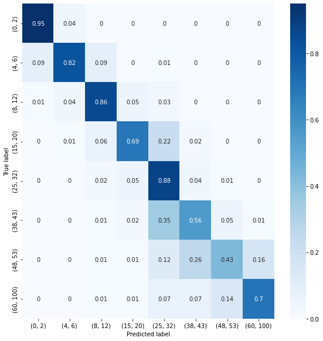
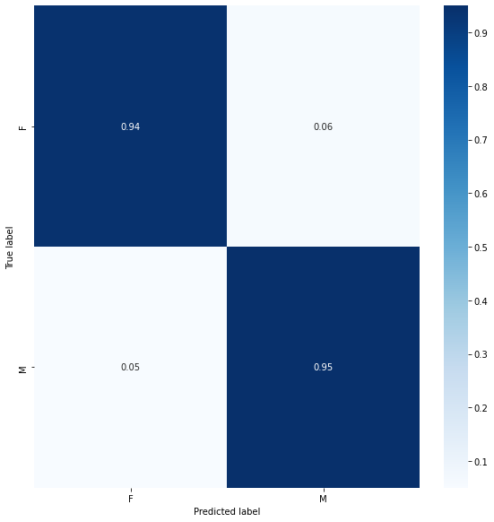
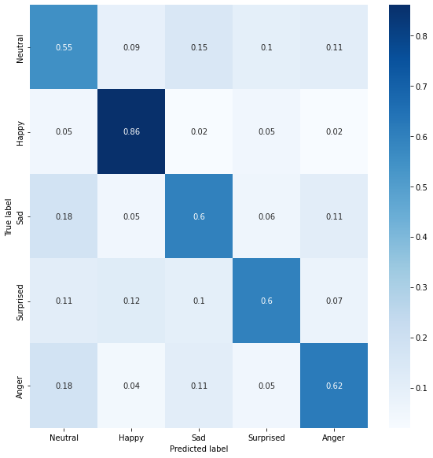

# Age-Gender-Detection-Keras

This application predicts the age, gender, and emotions of people captured via webcam input. The technique of transfer learning was used by leveraging the already existing neural network architecture [VGGFace](https://machinelearningmastery.com/how-to-perform-face-recognition-with-vggface2-convolutional-neural-network-in-keras/), which employs the original [Vgg16](https://medium.com/@mygreatlearning/what-is-vgg16-introduction-to-vgg16-f2d63849f615) architrecture, but specifically trained for facial recognition. I retrained the model separately to predict the age, gender, and emotion. These models were trained entirely using Google Colab for improved speeds using GPU hardware acceleration.

## Dataset 

The [Adience](https://talhassner.github.io/home/projects/Adience/Adience-data.html) dataset was used to train both the age and gender model. This dataset categorizes each image into male / female for the gender.

As for ages, it categorizes it into 8 distinct brackets: (0 - 2), (4 - 6), (8 - 13), (15 - 20), (25 - 32), (38 - 43), (48 - 53), (60 - 100).

Unforunately, one of the best facial emotion dataset [AffectNet](http://mohammadmahoor.com/affectnet/) is not accessible unless it's strictly for academic research. Thankfully, there is a sample available on [Kaggle](https://www.kaggle.com/mouadriali/affectnetsample) with around 40 000 samples in total that was used instead. 

Three categories: fear (class 005), disgust (class 006) and contempt (class 008) were ignored due to the relatively more ambigious nature, especially when compared to anger and sadness specifically.

## Architecture

The Vgg16 architecture comprises of 16 distinct layers. The first 13 of which consist of 3 by 3 convolutional layers with several max pooling in between. At the end of these 13 layers, the result is then flatten and fed into a series of fully connected layers, before entering a final softmax activation layer for the actual classification. 

By freezing the weights associated with the convolutional layers, we can preserve the strength of feature extraction of the original VggFace model. While changing the size of the fully conencted layers and allowing the weights to change enables us to fine tune the model for our own classification purposes. 

## Getting Started

These instructions will guide you through getting the project up and running on your local machine. 

### Prerequisites

The [requirements.txt](requirements.txt) file provides you with all the packages required for your environment in order for the program to run.

### Downloading the Models

The models can be downloaded directly from Google Drive (1.6 GB Each). 

- [Download](https://drive.google.com/file/d/164zrhdmcVzNkM5seyNN85vZ0W7DPtzdH/view?usp=sharing) the age model and extract its contents into the folder named model_age.

- [Download](https://drive.google.com/file/d/1f_FpwrfubrFKHKbK0hE9ERIv1erBjt5_/view?usp=sharing) the emotion model and and extract its contents into the folder named model_emotion.

- [Download](https://drive.google.com/file/d/1IISLSBI--Pzr0lsnryiRbrrQHqSy4HwQ/view?usp=sharing) the gender model and extract its contents into the folder named model_gender

### Running the Program

After all required packages are installed and all 3 models are downloaded into the directory, run the program using:
    
    python Final_cam.py

### Results / Discussions

We see that age model has problems mainly for the (15, 20), (38, 43), and (48, 53) ranges and more specifically categorizing them as (25, 32). 
This is primarly because the dataset used was unbalanced and the (25, 32) category had a much higher proportion of images. 

Furthermore, another possible reason is that the difference between facial features is less pronouced between these ranges as opposed to really young or extremely old.

However, the test accuracy was 78.77% and the one off accuracy (within one age range) was 96.01%, indicating that the model performs quite well.

The gender model on the other hand had a test accuracy of 94.85% with a relatively similar number of errors for both male and female classification. This could be caused by males with more female characteristics and vice versa.

Finally, the emotion model had mixed results. This is primarly because when the facial expression is subtle, there is a lot of ambiguity in the expressed emotion. 

Ultimately resulting in a test accuracy of 64.44%. However with testing, I found when the emotion is exaggerated, the results were often correct.

## Other Authors

  - **Billie Thompson** - *Provided README Template* -
    [PurpleBooth](https://github.com/PurpleBooth)

## License

This project is licensed under the [CC0 1.0 Uxdniversal](LICENSE.md)
Creative Commons License - see the [LICENSE.md](LICENSE.md) file for
details
